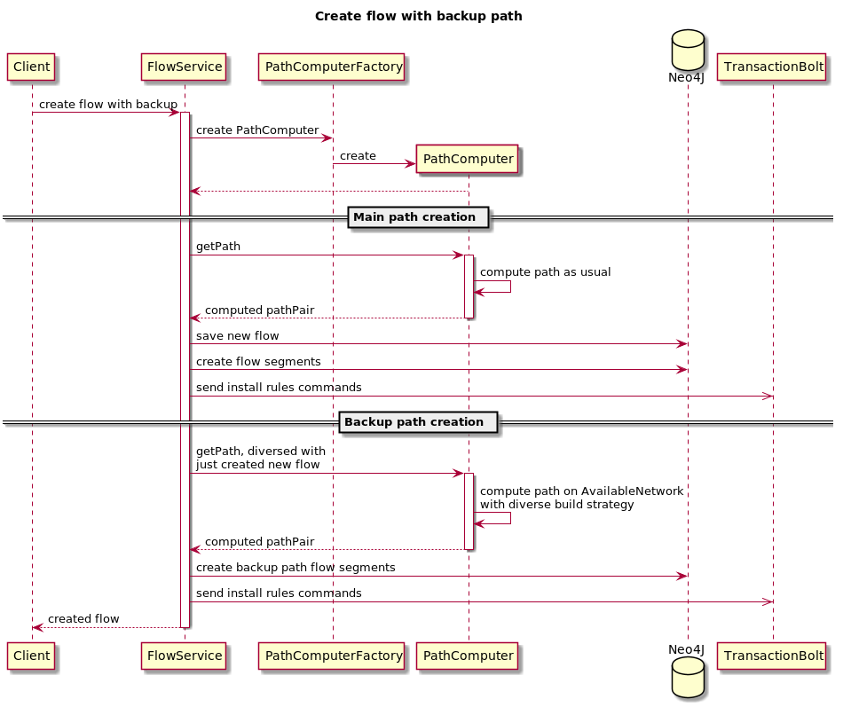
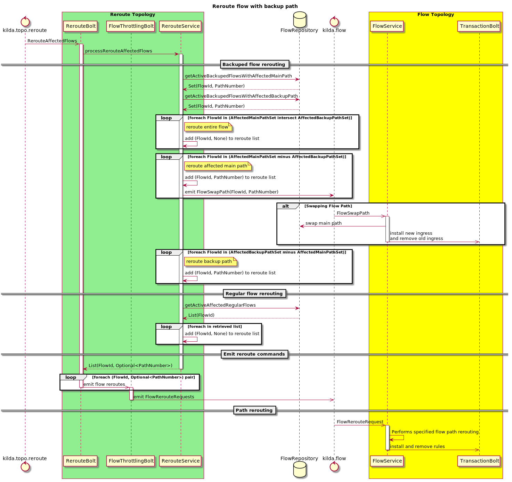

# Backup path for flow

## Goals
Calculate and deploy reserved diverse path for flow, so if the main path will fail we can switch traffic fast to reserved.

## API changes
- flow object should be extended with an boolean parameter allocate-backup-path with values false(default) and true
- /flows/{flow-id}/path should also return `backup_path' with the backup path and its diversity factor in comparison to the primary one.

## DB changes
- Flow: add allocate-backup-path and active-path properties.
- FlowSegment: path-number property.

Path will store as FlowSegments in Neo4J as usual. Flow active-path property match the current main path (FlowSegments with path-number chain).

### Sequence Diagrams

### Limitations
We still needed control plane to perform switching to reserved path, with several controller roundtrips.
