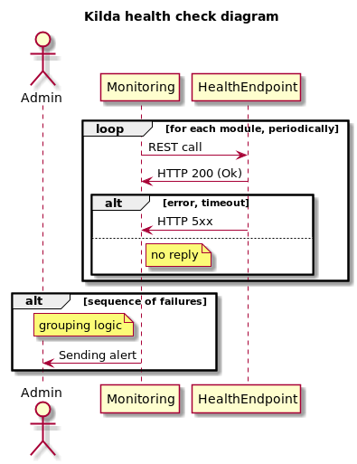

# Health checks
All modules have REST API health check endpoints. Monitoring software pulls this endpoints periodically:

## Health endpoints
- NB `/health-check`
- FloodLight `/wm/core/health/json`
- TE REST `/api/v1/health-check`

### Storm topologies
Nimbus has `/api/v1/topology/summary` endpoint, that provides actual status information about storm topologies.
It requires additional parsing job from Monitoring software

## Topology Engine
This is the only one module that don't has REST api and will be removed in future.

It may be done by monitoring kafka lag on TE topic, if processing stops - lag increases.