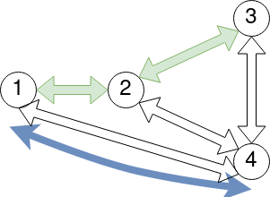
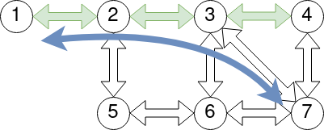
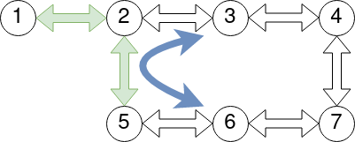
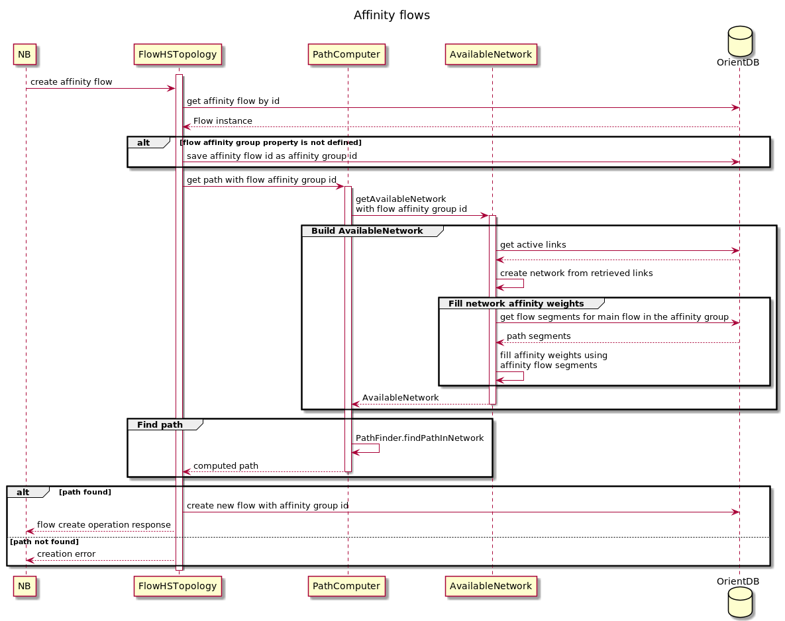

# Affinity flows

## Goals
The main goal is to be able to search for paths that maximally repeat the path of a certain main flow.

## NB contract changes
Create\Update Flow Request: add optional flow id, to make flow affinity with.

Flow Response: If flow is in an affinity group, flow response will contain an `affinity_with` field 
with a main flow id of that group.

## DB changes
Flow relation keeps flow affinity group id as a property.

## Path computation algorithm changes
In PCE flow affinity working similar to diversity groups. During available network computation weight for all edges not used by affinity flow paths is increased by the configurable parameter value. These penalties should make calculated paths to prefer reuse as many links as possible. In other words if we need to compare two possible paths: first step is to compare number of links unused by affinity flow and second step is compare weights by path computation strategy (cost, latency etc).  

### Use cases
1. Affinity flow has path 1-2-3. We need to build path from node 1 to 4. There are three available paths: 1-4, 1-2-4, 1-2-3-4. Since they all have only one link unused by main path they will have the same affinity penalty and the path with minimal total weight will be chosen. If we have equal initial weights for all these links we will use path 1-4 because it's total weight is minimal.

 
2. Affinity flow has path 1-2-3-4. We need to build path from node 1 to 7. A lot of paths are available but only two of them has one link unused by main path: 1-2-3-7 and 1-2-3-4-7. All other paths will have more links unused by main path and thus will have greater affinity penalty. If we have equal initial weights for all these links we will use path 1-2-3-7 because it's total weight is minimal.     

3. Affinity flow has path 1-2-5. We need to build path from node 3 to 6. Two paths are available 3-2-5-6 and 3-4-7-6. First path reuses one link from main flow so has lesser affinity penalty and should be used.

## Limitations
 - Flow can only belong to one flow affinity group.

 - Flow affinity groups are an implementation detail and there is no API to access it directly.

 - In the current implementation, affinity and diverse groups can not be specified at the same time for one flow.
   ([Diverse flows](../pce-diverse-flows/pce-diverse-flows.md))

 - In current implementation affinity groups doesn't support protected flows because protected flows implemented using diversity feature.

## Sequence Diagram

