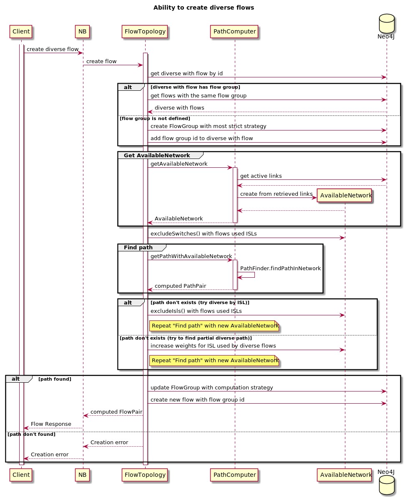

# Ability to create diverse flows

## Goals
Have redundancy on flows: different flows reside on different switches and/or ISLs.
Main goal is to find shortest diverse path with minimal overlapping.

## NB contract changes
Create\Update Flow Request: add optional flow id, to make flow diverse with.

Get Flow Path Response: if the flow belongs to diversity group, additionally returns other paths in group, with intersection statistics.

## DB changes
Flow relation keeps `flow group` id as a property.

## Algorithm
Initial, construct AvailableNetwork as usual.
Then fill AvailableNetwork diversity weights on edges(ISLs) and nodes(switches) what are used by paths in diverse group with some constants, passed as system parameters.

To avoid excessive complexity in weight strategies, propose always add static weights what are filling by additional AvailableNetworkFactory building options, like diversity.
Such static weights are either zero in default AvailableNetwork building scenario, or meaningful constant, if target flow has "flow group" property.

The final Edge weight computing formulas are: 
- `edge src sw static weight + edge strategy result + edge static weight + edge dest sw static weight` for the first Edge in path.
- `edge strategy result + edge static weight + edge dest sw static weight` for the rest Edges in path.

## Reroutes
The same logic is used - diversity weights will be filled if rerouting flow has "flow group" property.
Reroute will fail only if path not found.

## Limitations
Flow can belongs to only one flow group.

Flow groups is an implementation detail and there is no API to access it directly.

System knows nothing about physical network topology, so computed paths not truly diverse in hardware meaning.

## Sequence Diagram


### Flow Path Response schema (with diversity group paths)
```
{
  "flowid": "flow1",
  "flowpath_forward": [],
  "flowpath_reverse": [],
  "diverse_group": {
    // overlapping between flow1 path and other group paths
    "overlapping_segments": {
      "isl_count": 0,
      "switch_count": 2,
      "isl_percent": 0,
      "switch_percent": 100
    },
    // foreach other flow in group
    "other_flows": [
      {
        "flowid": "other1",
        "flowpath_forward": [],
        "flowpath_reverse": [],
        // overlapping between flow1 path and other1 path
        "overlapping_segments": {
          "isl_count": 0,
          "switch_count": 1,
          "isl_percent": 0,
          "switch_percent": 50
        }
      }
    ]
  }
}
```
