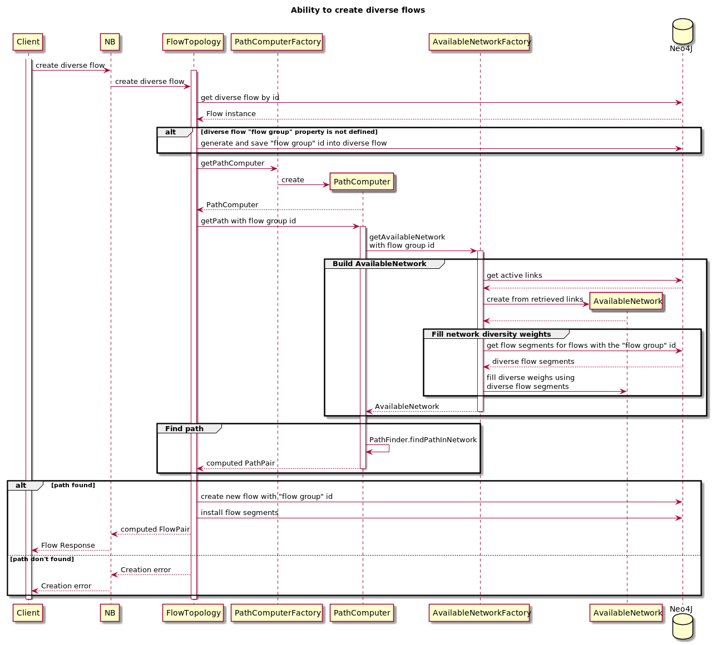

# Ability to create diverse flows

## Goals
Have redundancy on flows: different flows reside on different switches and/or ISLs
Main goal is to find shortest diverse path

## NB contract changes
Request: add flow id to make new flow diverse with

Response: applied diverse path computation strategy for computed diverse path

## DB changes
Create "FlowGroup" new node type in neo4j.
Flow relation keeps "FlowGroup" id as a property

## Algorithm
Construct AvailableNetwork as usual, then update costs on ISL and switches what are used by paths in diverse group

## Reroutes
The same logic is used. Reroute will fail only if path not found.
 
## Sequence Diagram

### Limitations
Flow groups is an implementation detail and there is no API to access it directly.

System knows nothing about physical network topology, so computed paths not truely diverse in hardware meaning
