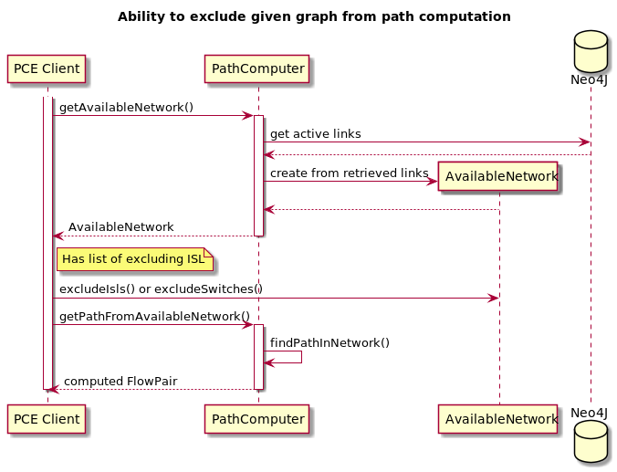

# Ability to exclude given graph from path computation

## Goals
Add general excluding mechanics in Computation Engine. It will be used in scenarios like:
- Calculate a diverse path
- Evacuate flows from ISL/Switch (reroute with exclude)
- Allow user to specify exclusion list from API

## Contract overview
There are two rules of excluding
- Exclude specified ISL
- Exclude entire switch

## Implementation notes
As rule sets assume not to be big, it's better (and easier) performs filtering on application side.

Exclude rules incapsulated in Exclude object, and applies inside PCE AvailableNetwork class.

### Sequence Diagram
