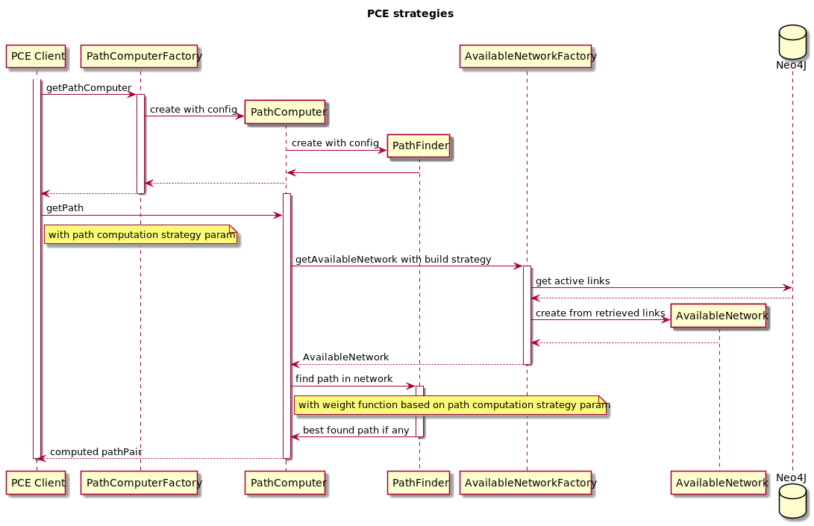

# Refactor PCE with weights computation strategies

## Goals
For now PCE uses only cost field as graph edges weights

While path computing logic going to be more complicated - we need to take several factors\costs to compute final edge\node weight, and keep this things maintainable.
Also built AvailableNetwork should be logged, to make strange computed paths investigation possible.

## Proposed changes
- Introduce PCE data model instead of reusing DAO: for storing graph weighs by features and more convenient logging
- Separate AvailableNetwork creation: it isn't responsibility of PathComputer
- Introduce weights computing strategies: like weight getters above data model, defines what weigh features will be used in path computation and in that proportions

### Weight strategy example
Suppose that we have `sw1 -> isl -> sw2` graph edge in diversity scenario, then weight strategy may looks like:
`sw1 diversity cost + isl cost + isl diversity cost + sw2 diversity cost`.

### Sequence Diagram
