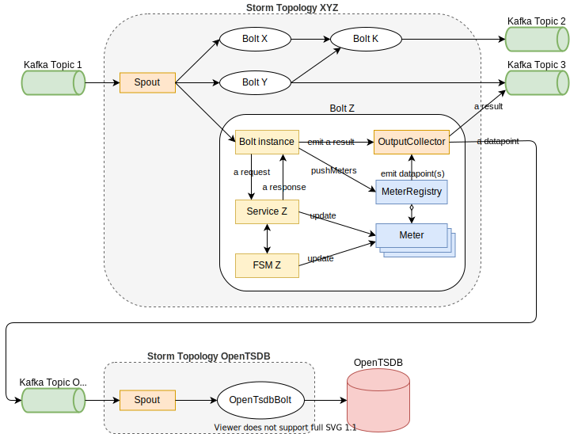
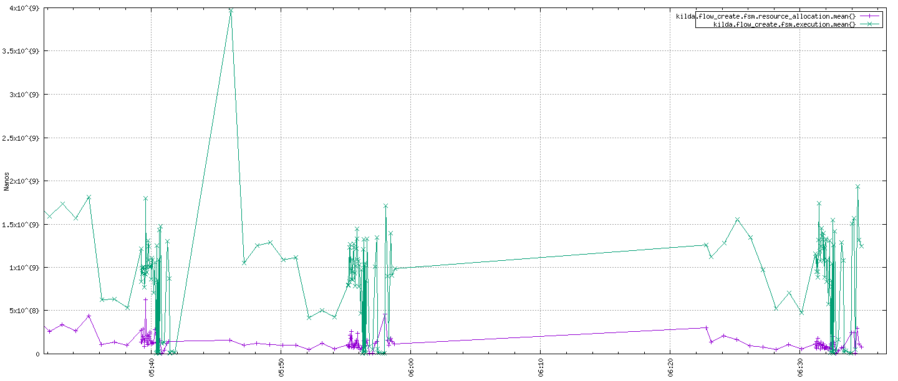
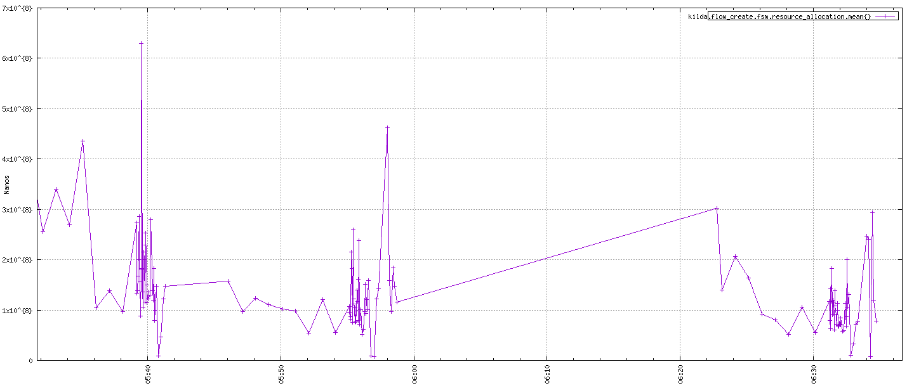

# Kilda Application metrics

## Overview
This doc describes the approach for collecting and publishing of Kilda application metrics.

## Goals
The goal is to gather application metrics from Kilda on the development and production environments.

The metrics are to be used for:
- Application performance monitoring and management (includes capacity planning and product development).
- Identify bottlenecks and determine the application scalability.
- Ensure that introduced changes don't cause performance degradation.

## The solution
There are 2 general types of deployable components in Kilda: 
- Stand-alone (run as a dedicated process)
- Storm topologies

The former can easily expose JMX or Prometheus end-point, and utilize either the push or pull collection methods.
  
But in the case of Storm topologies, we just submit them to a cluster. And Storm decides where and how they are run.
The pull method for metrics gathered in the topologies is too complicated in development and operations.

Apache Storm has a build-in monitoring API with an ability to publish (push) metrics - https://storm.apache.org/releases/1.2.3/Metrics.html, 
but it's interval based - a metric implementation aggregates collected data and pushes the result periodically. 
This doesn't give us required precision of per event results, instead, we'll see a mean of multiple event results.  

Therefore, the push collection method along with a per-bolt registry is to be used for metrics  from Storm topologies:
- Each bolt with metrics must have own metric registry.
- Each bolt with the registry must define a check-point when it pushes all data-points to OpenTSDB: 
on a tick or when a tuple is processed. 

### Metric examples
Flow Create - complete FSM execution

Flow Create - Resource allocation

