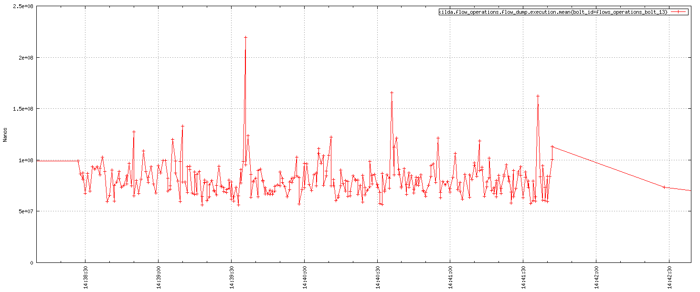
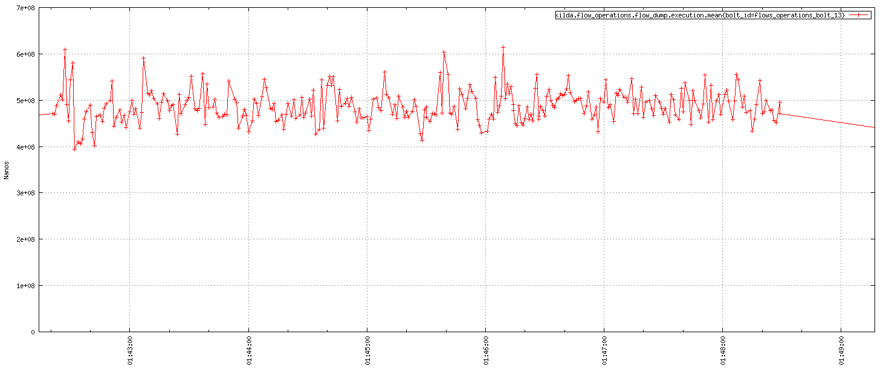
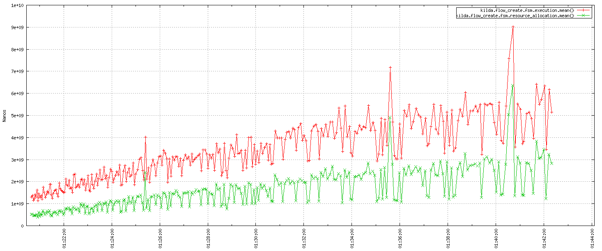
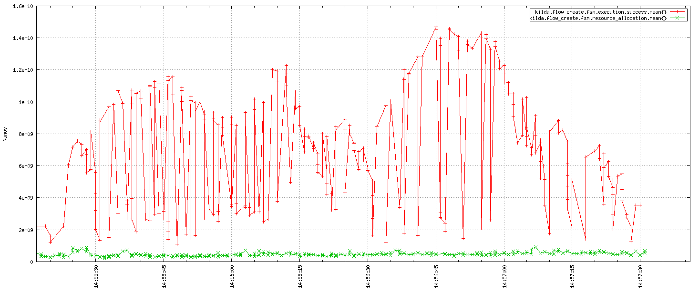
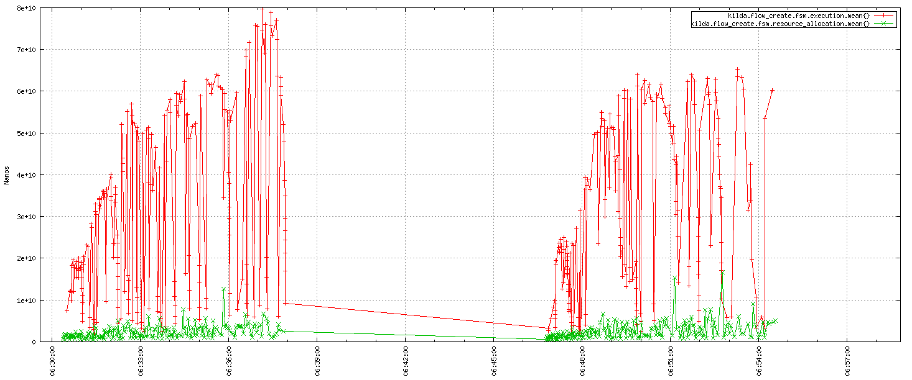
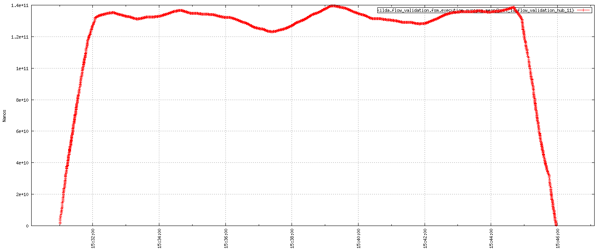
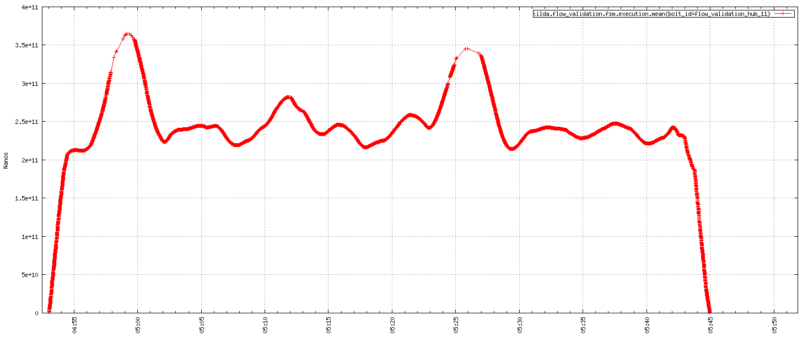
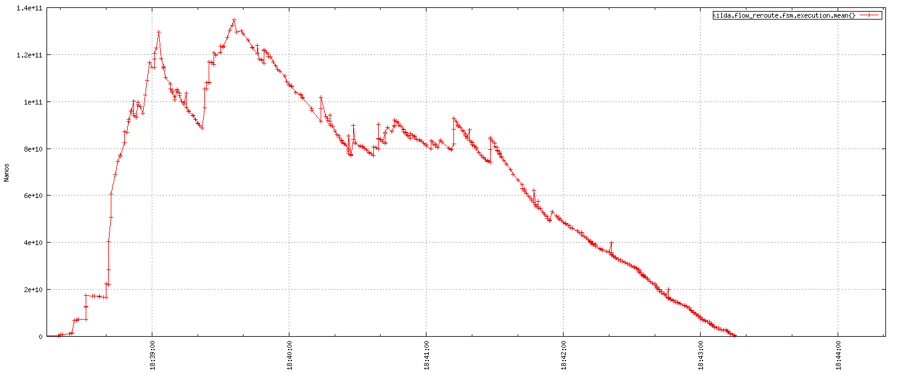

# Kilda performance testing - Neo4j vs OrientDB persistence layer

## Dump flows
Neo4j | OrientDB
--- | ---
 | 

## Create a flow
Neo4j | OrientDB
--- | ---
 | 

## Create a flow (concurrent)
Neo4j | OrientDB
--- | ---
 | 

## Validate a flow (concurrent)
Neo4j | OrientDB
--- | ---
 | 

## Reroute a flow (concurrent)
Neo4j | OrientDB
--- | ---
 | 
