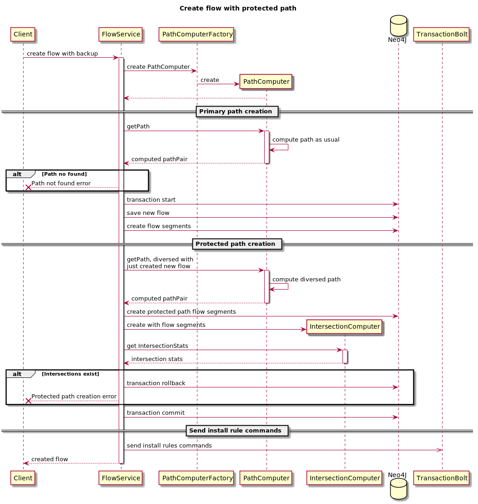
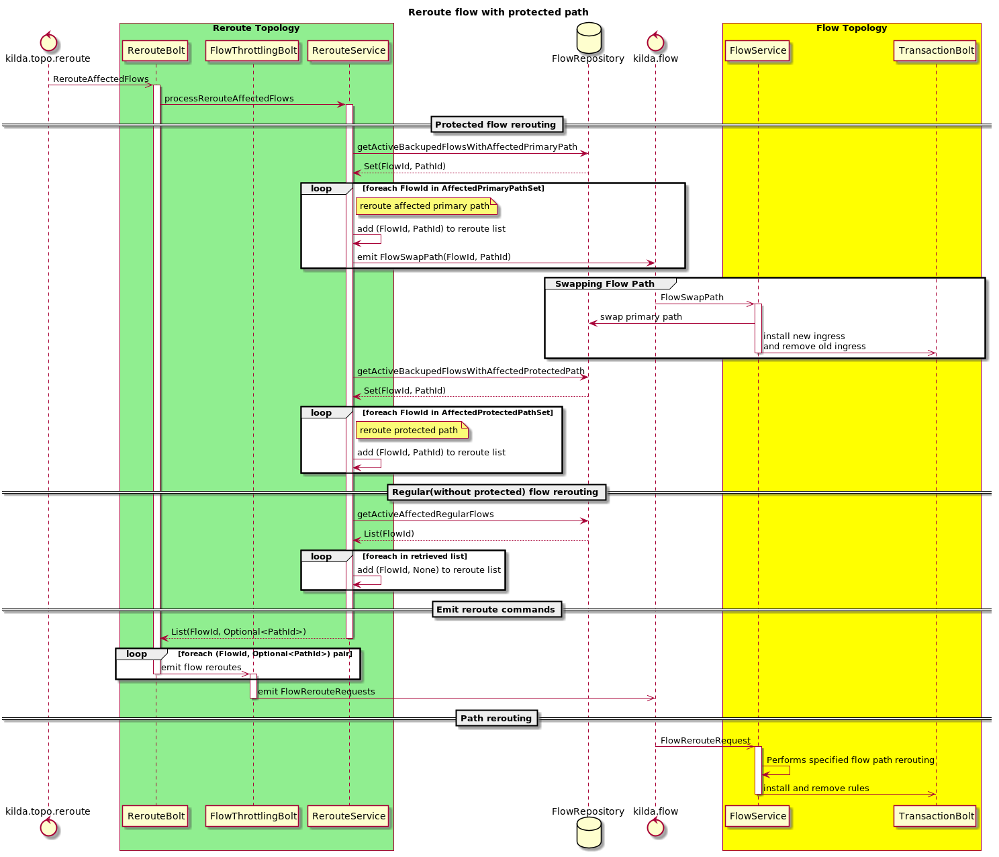

# Protected path for flow

## Goals
Calculate and deploy protected diverse path for flow, so if the primary path will fail we can switch traffic fast to protected path.

## API changes
- flow object should be extended with an boolean parameter allocate-protected-path with values false(default) and true
- /flows/{flow-id}/path should also return `protected_path` with the protected path.

## DB changes
- Flow: add allocate-protected-path, primary-path-id, protected-path-id properties.
- FlowSegment: path-id property.

Path will store as FlowSegments in Neo4J as usual. Flow primary-path-id property match the current primary path (FlowSegments with path-id chain).

Protected path must be fully diverse from the primary one, in terms ISL or switches (configurable). If no overlapping protected path cannot be find, flow move to DOWN state. 

### Sequence Diagrams



### Get path response example
GET `/flows/flow1/path` example response, when `flow1` has protected path and another flow `other1` is in the same diversity group, with its out protected path
```
{
  "flowid": "flow1", 
  "flowpath_forward": [], 
  "flowpath_reverse": [], 
  "protected_path": { // flow1 protected path 
    "flowpath_forward": [], 
    "flowpath_reverse": []
  },
  
  // other flows in the flow group, with statistics relative to flow1 primary path
  "diverse_group": { 
    "other_flows": [
      {
        "flowid": "other1", 
        "flowpath_forward": [], 
        "flowpath_reverse": [], 
        "overlapping_segments": { // overlapping between flow1 primary path and other1 primary path
          "isl_count": 0, 
          "isl_percent": 0, 
          "switch_count": 1, 
          "switch_percent": 50
        }, 
        "protected_path": {
          "flowpath_forward": [], 
          "flowpath_reverse": [], 
          "overlapping_segments": { // overlapping between flow1 primary path and other1 protected path
            "isl_count": 0, 
            "isl_percent": 0, 
            "switch_count": 1, 
            "switch_percent": 50
          }
        }
      }
    ], 
    "overlapping_segments": { // overlapping between flow1 primary path and other flows in the group 
      "isl_count": 0, 
      "isl_percent": 0, 
      "switch_count": 2, 
      "switch_percent": 100
    }
  }, 
  
  // other flows in the flow group, with statistics relative to flow1 protected path
  "diverse_group_protected": {
    "other_flows": [
      {
        "flowid": "other1", 
        "flowpath_forward": [], 
        "flowpath_reverse": [], 
        "overlapping_segments": { // overlapping between flow1 protected path and other1 primary path
          "isl_count": 0, 
          "isl_percent": 0, 
          "switch_count": 1, 
          "switch_percent": 50
        }, 
        "protected_path": {
          "flowpath_forward": [], 
          "flowpath_reverse": [], 
          "overlapping_segments": { // overlapping between flow1 protected path and other1 protected path
            "isl_count": 0, 
            "isl_percent": 0, 
            "switch_count": 1, 
            "switch_percent": 50
          }
        }
      }
    ], 
    "overlapping_segments": { // overlapping between flow1 protected path and other flows in the group 
      "isl_count": 0, 
      "isl_percent": 0, 
      "switch_count": 2, 
      "switch_percent": 100
    }
  }
}

```

### Limitations
We still needed control plane to perform switching to protected path, with several controller roundtrips.
