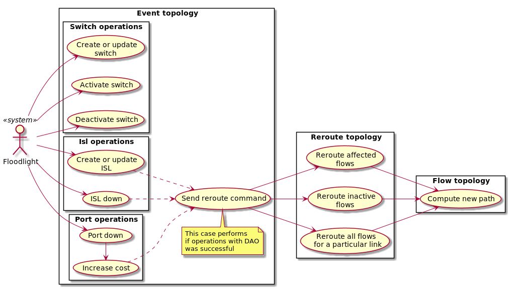
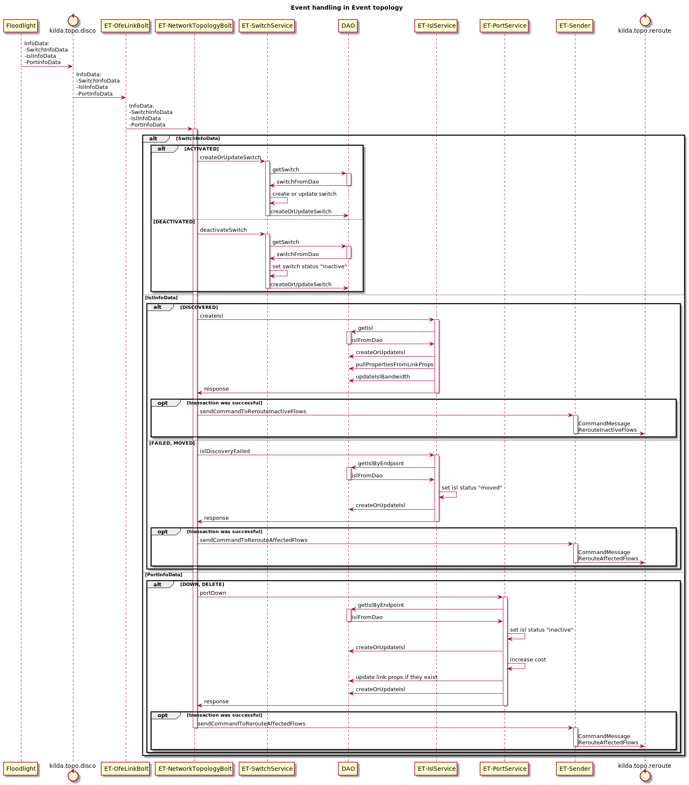
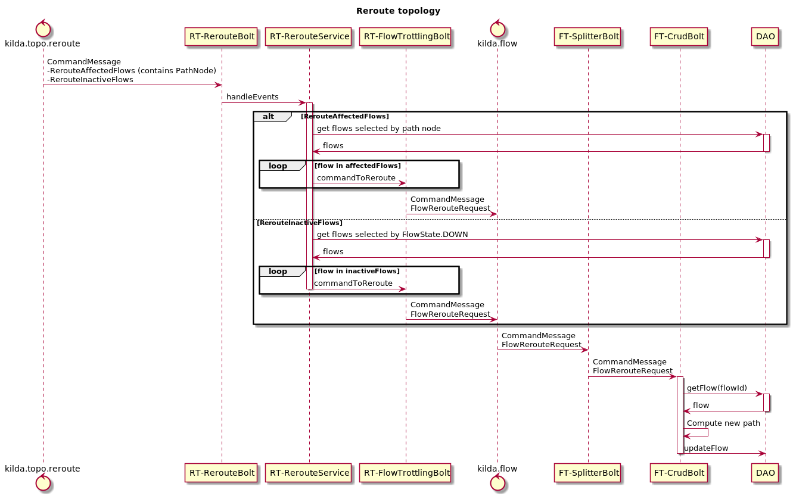

# Reroute topology: eliminate Cache topology

## The problem 
One of the things that blocks Hub&Spoke is the Cache topology. The main task of Cache topology is rerouting flows. 
We need to implement this functionality as a new topology. The part related to processing events (SwitchInfoData,
IslInfoData, PortInfoData) should be implemented in the Event topology.
### Use case

### Sequence diagram

### Implementation
Pull request: #1520 (Implementation of the Reroute topology and NetworkTopologyBolt in the Event topology)
