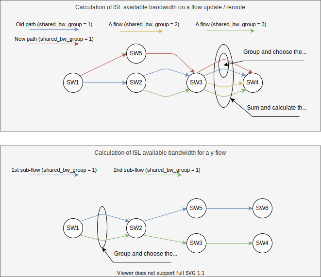
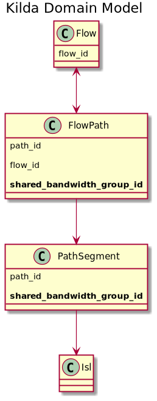

# Shared bandwidth

## Overview
This doc describes the solution for sharing allocated bandwidth among several flow paths (including protected paths, 
temporary paths appeared during update/reroute operations, and y-flow sub- paths).

## The problem
OpenKilda for a single flow between 2 endpoints can build several paths and allocate ISL bandwidth for each of them.
Normally, only one path carries flow traffic, while other paths (protected or temporary) just wait when 
the traffic needs to be switched from the main path to them. But allocated bandwidth occupies ISLs and prevents 
Kilda from effective resource utilization.

Here are 2 common cases when Kilda allocates excessive ISL bandwidth:
- During flow update/reroute operations, a temporary path is created with allocated bandwidth. 
Once the temporary path is installed and validated, the flow traffic in switched to it.
And although the old path is deallocated, for some period of time, Kilda takes double bandwidth from ISLs and may even over-provision and leave
an ISL with negative available bandwidth.

- A y-flow by design have 2 or more paths sharing ISLs. The common (shared) part of all sub-flows must occupy only 
bandwidth requested by the y-flow. Without the shared bandwidth solution 2 sub-flows will allocate double bandwidth.

## Solution overview
The goal is to avoid repetitive bandwidth allocation on an ISL if 2 or more bound flow paths lay on it. 
So, Kilda must group such bound paths. For this purpose, a new property ("shared_bandwidth_group") is to be introduced on the path and path segment levels. 

The available bandwidth for an ISL is calculated by deducing from ISL capacity the allocated bandwidth of all related path segments:
- With no grouping - ```available_bandwidth(ISL) = bandwidth(ISL) - ∑ bandwidth(PSₙ)```, where PS is a set of path segments that lay on the ISL.
- With grouping - ```available_bandwidth(ISL) = bandwidth(ISL) - max(PS₁) - max(PS₂) - ... - max(PSₖ)```, where PS₁, PS₂ ... PSₖ are sets of path segments grouped by 1, 2, ... k correspondingly.

The group is defined at the moment of flow creation and assigned to all related paths:
- A flow has the main, protected and temporary paths. All of them have the same "shared_bandwidth_group" equals to the flow ID.
- A y-flow has 2 or more sub-flows and each of them the main, protected and temporary paths. All paths have the same "shared_bandwidth_group" equals to the y-flow ID.

### Available bandwidth calculation



### Data model changes



From persistence perspective, "shared_bandwidth_group" is just an additional property on `flow_path` and `path_segment` graph nodes with corresponding indexes.

### API
No changes required in public API or internal messaging.

### PCE changes
Normally, PCE relies on ISL available bandwidth which is already precalculated. But in the case of flow reroute/update operations, PCE accepts a list of paths to reuse their bandwidth.
The path grouping must be taken into account - bring back the allocated bandwidth only once for each group.
