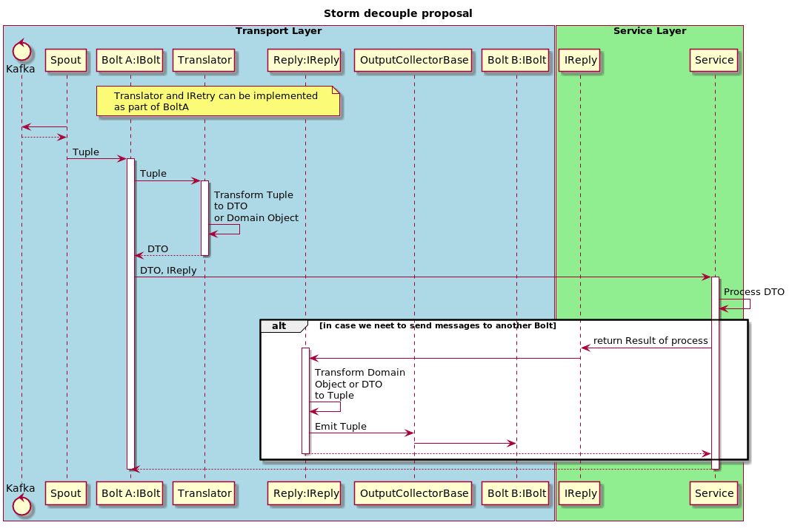

# Storm decouple
## Goals
- Separate domain logic from the transport layer.
- Have the ability to create and run simple unit tests without Storm.
- Simplify the logic of an application.

## The idea
Move domain logic of the application to the service layer. Interaction between
layers through an interface from the service layer.

## Diagrams
