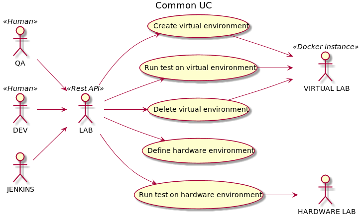
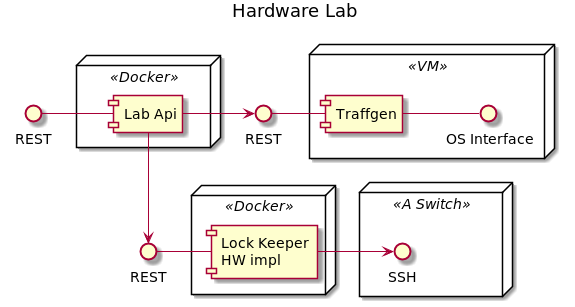
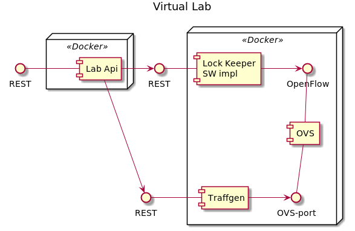
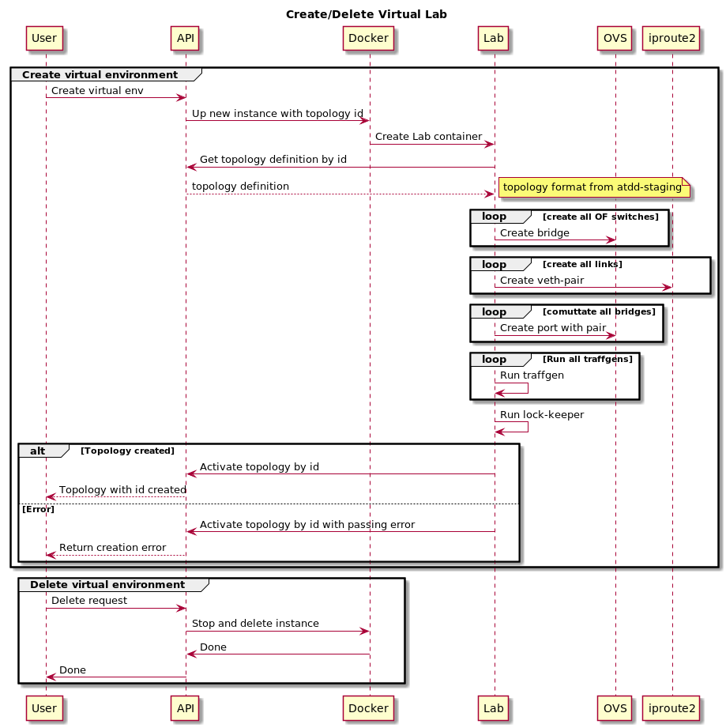

# Test lab

## Goals
Run functional and acceptance tests on hardware and virtual
environment without code change.

## The idea
Create abstract API layer for hardware and virtual environment.

## Diagrams

### Use Case


### Component




### Sequence


### Lab API

#### Create virtual lab
```
POST <lab-api-host>/api/
BODY: topology format from functional-tests
RESPONSE: new lab id (int)
```
#### Define hw lab
```
POST <lab-api-host>/api/
Header: "Hw-Env: HW"
BODY: topology format from functional-tests
RESPONSE: lab id==0, or HTTP code 409 when hw lab is allready accured 
```
#### Delete lab
```
DELETE <lab-api-host>/api/<lab_id>
RESPONSE: 200 OK
```
#### Get lab definition
```
GET <lab-api-host>/api/<lab_id>
RESPONSE: topology format from functional-tests
```
#### Get defined labs
```
GET <lab-api-host>/api
RESPONSE: array of defined lab id
```
#### Access to lock-keeper
Proxy call to lock-keeper host
```
PROXY <lab-api-host>/api/<lab_id>/lock-keeper
```
#### Access to traffgen
Proxy call to traffgen host
```
PROXY <lab-api-host>/api/<lab_id>/traffgen
```
