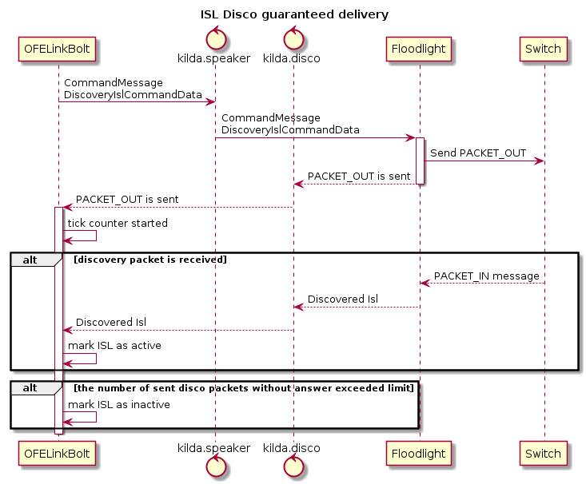

# Guaranteed sending ISL disco packets by speaker

## The problem
Currently Event topology (WFM) expects that speaker sends disco packets right after ET topology sends it. But there is a possibility that speaker might be blocked/busy by processing another requests and is not able to send disco packets. In that case ET may think disco packet is already sent and they are not received by the switch on the other side, which means that ISL will be marked as inactive. Besides, all ISLs in the entire network will be marked as well.

## The idea
To ensure that speaker is sending disco packets and disco packets really are not reaching destination switches.

## Implementation

