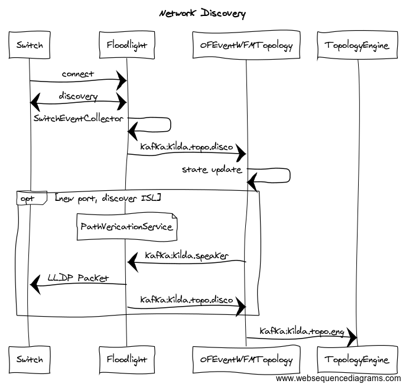

# USE-CASE: Network Topology Discovery

## Introduction

This file introduces the design for network discovery within kilda.

## Development

Look in `base/hacks/usecase/network.disco.make` for hints on how to develop and debug this UC.

## High Level Algorithm

When a switch connects to the controller, through the floodlight module, a series of events happen
that result in the network topology showing up in the network graph. This section describes these
series of events at a high level.

1. The switch connects to kilda through floodlight.
2. Floodlight pushes a series of events, in the form of kafka messages (topic: kilda.topo.disco)
    - _ NB: look at services/src/messaging/src/main/java .. Topic.java for latest value._
3. Storm (OFEventWFMTopology) picks up these messages and does the following:
    1. updates its state
    2. if a port has been discovered, send an ISL discovery request to floodlight 
        (topic:kilda.speaker.disco)
    3. forward state changes to the topology-engine (topic: kilda.topo.eng)
    4. (optional) the Storm topology may exercise some business logic before forwarding an event
        to the topology engine. As an example, verifying an up/down event (ie suppress flapping)
   

## Sequence Diagram

### Sequence Diagram Graph




### Sequence Diagram Text

This text can be used at https://www.websequencediagrams.com/

```
title Network Discovery

Switch->Floodlight: connect
Switch<->Floodlight: discovery
Floodlight->Floodlight: SwitchEventCollector
Floodlight->OFEventWFMTopology: kafka:kilda.topo.disco
OFEventWFMTopology->OFEventWFMTopology: state update
opt new port, discover ISL
    note over Floodlight: PathVericationService
    OFEventWFMTopology->Floodlight: kafka:kilda.speaker.disco
    Floodlight->Switch: LLDP Packet
    Floodlight->OFEventWFMTopology: kafka:kilda.topo.disco
end
OFEventWFMTopology->TopologyEngine: kafka:kilda.topo.eng

```     
