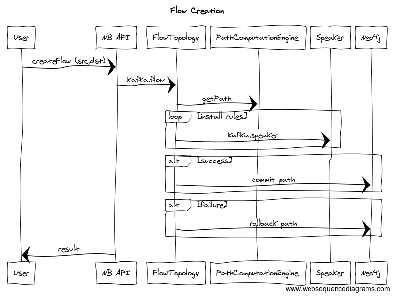

# USE-CASE: FLOW CRUD Discovery

## Introduction

This file introduces the design for flow management (create, read, update, deleted) within kilda.

The Flow CRUD use case focuses on the (mostly) user initiated management of flows. There are 
separate use cases for flow health checks, flow re-routing (ie network path failure, cost 
optimization, contract alignment wrt latency), and flow storm topology LCM (ie for anything
stateful, how does it regain the stat information after a re-launch).

## Development

Look in `base/hacks/usecase/flow.crud.make` for hints on how to develop and debug this UC.

## High Level Algorithm

When a user initiates a CRUD request, it starts with sending a request to the NB API. The NB API
will forward the request to the Flow Topology through a Kafka topic (kilda.flow). Because this is
an asynchronous operation (southbound from the API), a correlation ID is used to enable the NB
API to match the response.  

### Flow Creation

For Creation, the flow topology will get a path from the Path Computation Engine (PCE), which is a 
facade on top of Neo4j for release 1.0. With the path in hand, the flow engine will send a series 
of flow commands to the openflow speaker (floodlight) to install the flow rules on each switch in
 the path. After that is done successfully, the path is committed (ie distributed transaction) and
 a response is sent to the NB API.

#### Sequence Diagram


")

#### Diagram Text

This text can be used at https://www.websequencediagrams.com/

```
title Flow Creation

User->NB API: createFlow (src,dst)
NB API->FlowTopology: kafka.flow
FlowTopology->PathComputationEngine: getPath
loop install rules
    FlowTopology->Speaker: kafka.speaker
end
alt success
    FlowTopology->Neo4j: commit path
end
alt failure
    FlowTopology->Neo4j: rollback path
end
NB API->User: result
```     
 
### Flow Deletion

### Flow Update

### Flow Read

   
