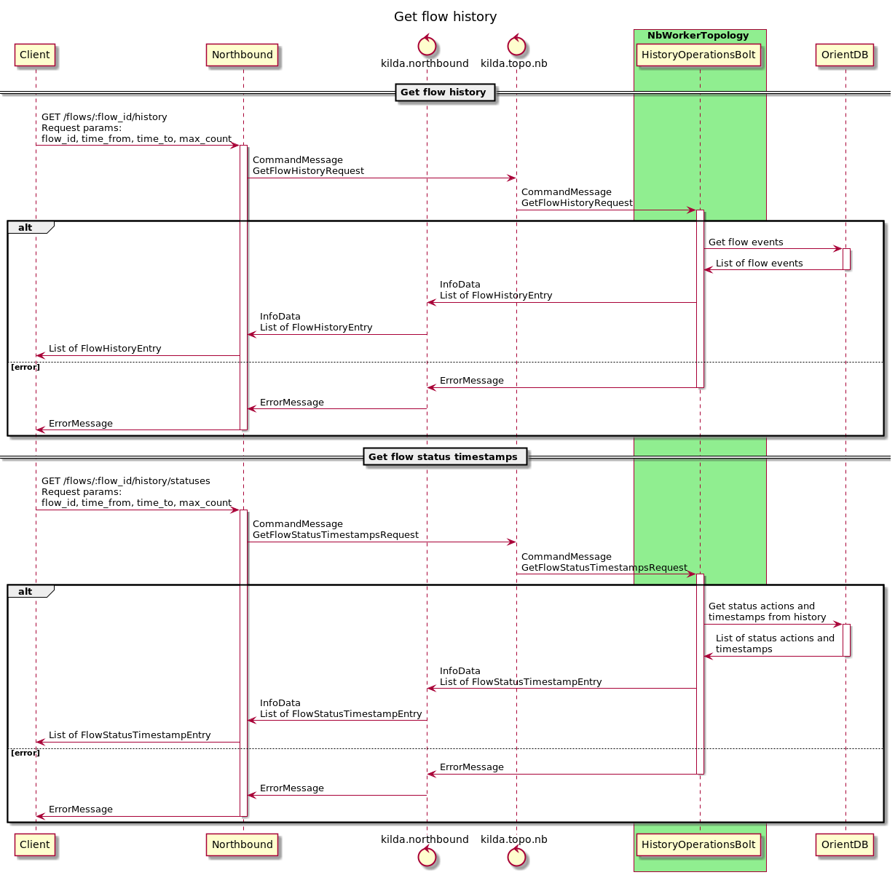

# Get flow history
## The idea
We should be able to get list of the flow operations with timestamps. 
This information should also include description of the flow actions during the flow operation.

## Sequence diagram


## API
Northbound provides following endpoints for getting flow history:

#### Getting all the flow history:
`GET /flows/:flow_id/history`
with request params:
* `flow_id` - Flow ID
* `time_from` - Start time to search for flow history (default: 0 (1 January 1970 00:00:00)).
* `time_to` - End time to search flow history (default: now).
* `max_count` - Number of records viewed (default: 100).

Example of a response to the request:
```
[{
  "clazz": "org.openkilda.messaging.payload.history.FlowHistoryEntry",
  "flow_id": "flow_id",
  "timestamp": 1612898925,
  "actor": "AUTO",
  "action": "Flow rerouting",
  "task_id": "40eb352b-8f1e-41a1-8da0-953820e92c12 : 1612898884095",
  "details": "Reason: initiated via Northbound",
  "payload": [
    {
      "timestamp": 1612898925,
      "action": "Started flow validation",
      "details": null
    },
    {
      "timestamp": 1612898926,
      "action": "Flow was validated successfully",
      "details": null
    },
    {
      "timestamp": 1612898927,
      "action": "Found the same primary path. Skipped creating of it",
      "details": null
    },
    {
      "timestamp": 1612898927,
      "action": "The flow status was reverted to UP",
      "details": null
    },
    {
      "timestamp": 1612898927,
      "action": "Failed to reroute the flow",
      "details": "Reroute is unsuccessful. Couldn't find new path(s)"
    }
  ],
  "dumps": []
}]
```

#### Getting all the flow status timestamps:
`GET /flows/:flow_id/history/statuses`
with request params:
* `flow_id` - Flow ID
* `time_from` - Start time to search for flow status timestamps (default: 0 (1 January 1970 00:00:00)).
* `time_to` - End time to search flow status timestamps (default: now).
* `max_count` - Number of records viewed (default: 100).

Examples of possible responses to the request:
* First option:
```
[{
  timestamp: 1613128414950,
  status: UP
}, 
{
  timestamp: 1613128438625,
  status: DEGRADED
}, 
{
  timestamp: 1613128459951,
  status: DELETED
}]
```

* Second option:
```
{
  "1613128414950": "UP",
  "1613128438625": "DEGRADED",
  "1613128459951": "DELETED"
}
```
