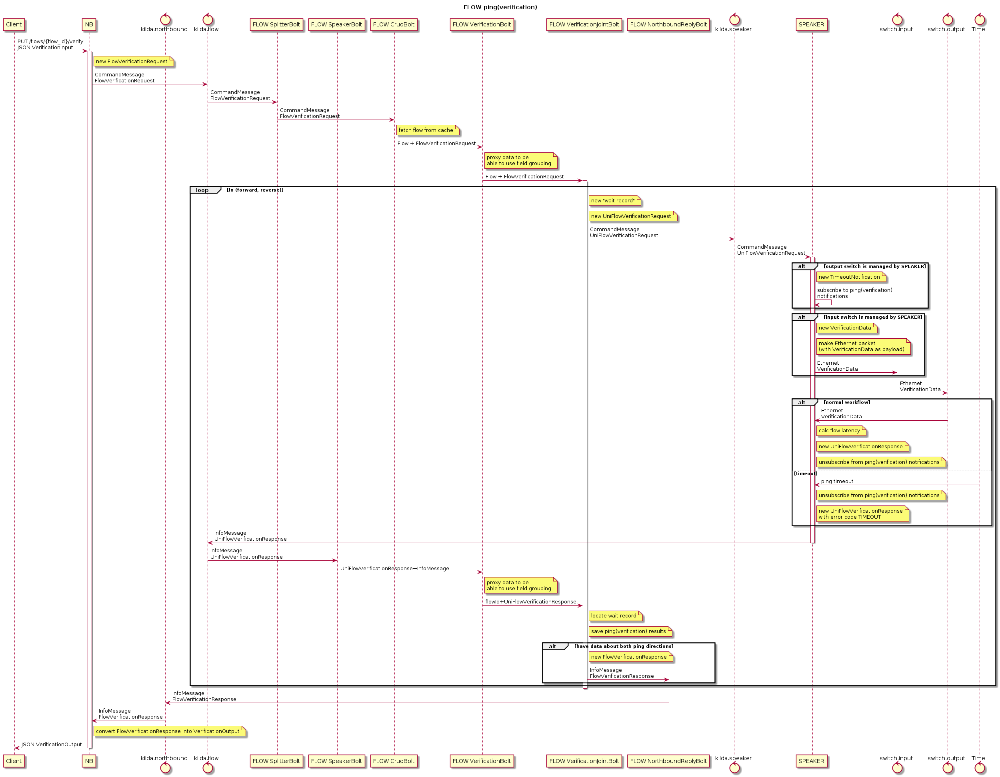

# Flow ping (verification)

## The idea
Use our link validation mechanism to validate whole flow. We can inject 
validation packet on edge switch, it will be "routed" using flow rules on all 
intermediate switches and cached on the edge switch on other side of flow
("packet out" message must specify special out port called "TABLE" to pass
packet via existing on switch open flow rules).

## Goals
* measure flow latency
* one more way to verify switch availability (detect control plane issues)

## Implementation

