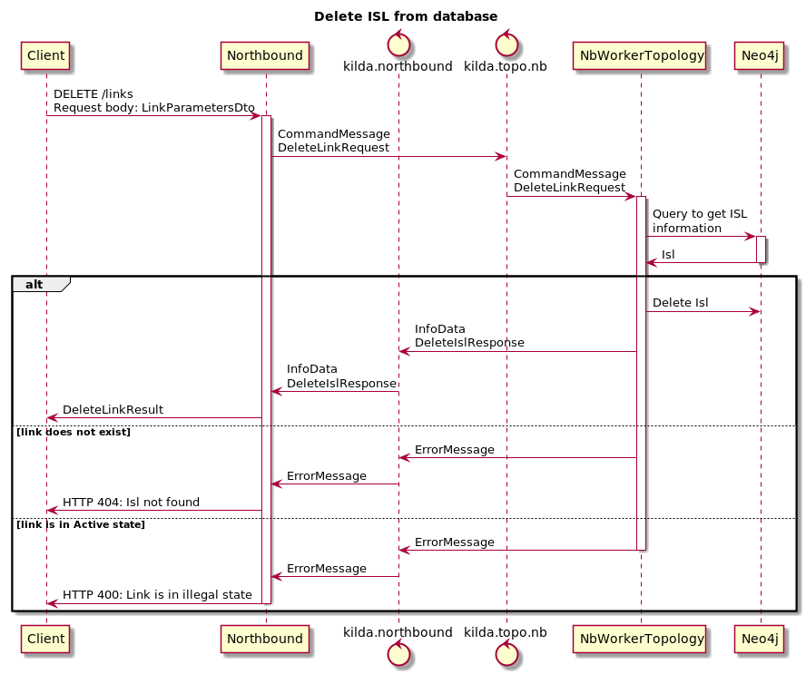

# Delete ISL API

 ## The idea
Add ability to delete ISL from Database.
ISL must be deactivated before delete.

 ## Implementation
 New API: DELETE request `/links`
 This request has 4 request body parameters:
 `src_switch`, `src_port`, `dst_switch`, `dst_port`. 
 All parameters are mandatory.

### Sequence Diagram
 

