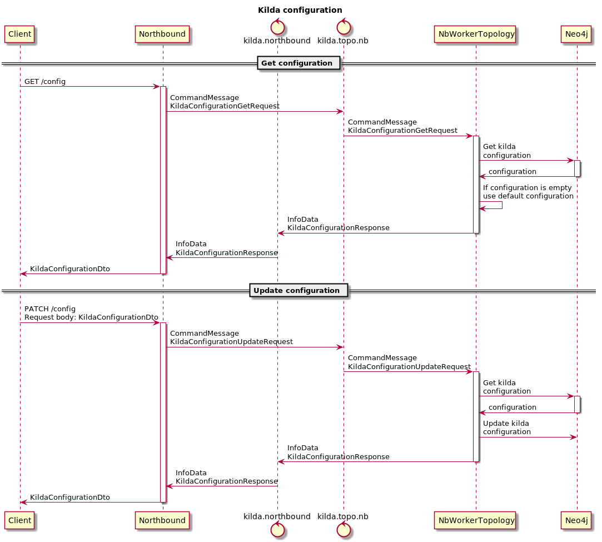

# Kilda configuration in the Database

## The idea
Add ability to create or update kilda configuration in the Database.

Currently this API is needed to set the default encapsulation type for the flow.

## New API
* GET `/config` returns current configuration.
* POST `/config` updates current configuration and returns new configuration.
This request has a request body parameter `flow-encapsulation-type`.

### Sequence Diagram
 

