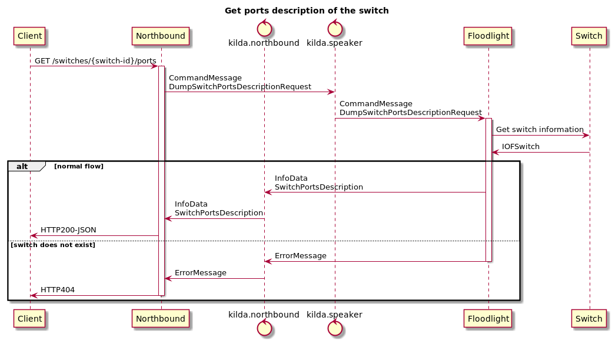

# Get a description of the switch ports from Floodlight via Northbound API 

## The idea
To have the ability to get ports description of the switch via Northbound API.

## Goals
Get ports description of the switch via Northbound API.

## Implementation

