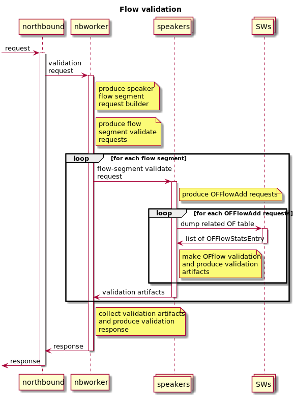

# Validation

## Definition
Validation in open-kilda word is called process that check existence and 
correctness installed on switches OF flows. It is aimed to detect OF flows
modifications done not via open-kilda API. Or done by switch itself.

Results produced by validation process can be used to install missing OF
flows and to remove excess or incorrect OF flows.

## Scope
Validation process can be done on flow level or on switch level.

On flow level it will check all OF flows related to specified kilda-flow. It
capable to detect specific flow corruption.

On switch level it will check all OF flows that goes through or terminate on
specified switch. Also it check so called "default" or "service" OF flows used
for network discovery, latency measurement, loop prevention and other system
wide services. Only switch level validation can detect excess OF flows, because
it operate with all entities related to specified switch and as result can
detect "extra" (not related to any kilda service/entity) OF flows.

## Current design

At this moment validation is split on 2 independent parts:
 * dump and serialise (partial) OF flows (speaker)
 * flow validation - build kilda-flow representation and compare with OF flow
   dumps from speaker (nbworker)
 * switch validation - build kilda representation of OF flows related to switch
   and compare with OF flow dumps from speaker (switch manager)

This "schema" have several problems:
 * at least 2 services must reimplement speaker logic in building OF flows (so
   they can be able to build kilda representation for some entity)
 * OF flows must be serialised in some custom format (OF flows have complex
   structure and making custom partial view is complex task. Incorrect OF flow
   representation leads to false-positive or false-negative validation checks)
 * any new entity (in most cases event update existing entity) that require OF
   flows (almost any kilda-entity) require it's implementation/integration with
   validation code

## Proposition

Reuse code that produce OF flows modify massages for validation purposes. In
other words speaker already create OF flow modify request to install/remove OF 
flows. This request contain all "data" that must be stored into OF flow on
switch side. So it is must complete representation of desired OF flow.

So to verify some kilda-entity we need to produce OF flow install request for
this entity, collect all affected OF tables, dump their OF flows and compare
with initial list of install requests.

Also we should collect all validation related component into single
service/topology. I.e. move flow validation from nbworker into switch manager
and remove switch manager into something like flow validation.

### Benefits
* single "point" in code responsible for building OF flow representation
* the check can be as strict as possible (because of complete data set about
  OF flow we can check as many field in it as we want)
* simplify integration of new kilda-entities - there is no need to update
  validation code after introducing of new kilda-entity (new OF flows)
* it is already implemented for flow-segment entities (part of H&S CRUD
  operations)

### Drawbacks 
* validation is done inside speaker (increase load) (it can be moved out, but
  it restores requirement on custom OF flows representation)

### Potential/future kilda entities integration
Each kilda-entity in any case have it's part in speaker, responsible for
install/remove OF flows. So it should be designed in the way when it can produce
list of OFFlowAdd requests without actual sending them into switch. And this is 
the main requirement for integration into validation service. 

### Flow validation implementation

