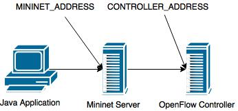

# Mininet Tools

Provides a simple Java interface to the mininet_rest.py service allowing one to create Mininet topologies directly from Java applications attached to a remote OpenFlow controller.

## How To Create a Topology

Creating a topoligy is straight forward and accomplieshed via a Fluent API.  The  first step is to create a controller object.

```
String controllerAddress;			// IP or Hostname
TransportPort controllerPort;		// TCP port controller is listening on
OFVersion ofVersion;				// OpenFlow Version (Usually OFVersion.OF_13)
String controllerName;				// Unique name for the controller

IMininetController controller = new MininetController()
        .setIP(controllerAddress)
        .setPort(controllerPort)
        .setVersion(ofVersion)
        .setName(controllerName)
        .build();
```

Once the controller is created you can add switches and create links.  Note that order is important:

1. addMininetServer - establishes connection to Mininet server running mininet_rest.py
2. addController - adds the controller created previously
3. addSwitch - can be repeated multiple times; creates a switch in Mininet associated with the controller
4. addLink - can be repeated multiple times; creates a link between the two name nodes
5. build - builds the mininet config

An example of creating a simple 2 node linear topology.

```
IMininet mininet = new Mininet()
        .addMininetServer(MININET_ADDRESS, MININET_PORT)
        .clear()
        .addController(controller)
        .addSwitch("sw1", DatapathId.of(1))
        .addSwitch("sw2", DatapathId.of(2))
        .addLink("sw1", "sw2")
        .build();
```

## Network Topology

This bit can be confussing depending on where the Controller and Mininet server are running.  

The address passed to ```addMininetServer``` is the IP/Hostname of the Mininet server from the perspective of the calling Java appliation.  That is, if you are running the Java application on your workstation and the Mininet Server is running on a VM, this is the IP/Hostname of the VM.  If the Mininet Server is running on your workstation locally then it would be localhost.

The address passed to ```IMininetController.setIP``` is the IP/Hostname of the OpenFlow controller from the perspective of the Mininet Server.  If the Mininet Server is running in a VM and the OpenFlow Controller is running in another VM, then this would be the IP of the Controller VM which is reachable from the Mininet VM.

Simple network diagram showing which IP's to use:



### Specific to using the Dockerized version of Kilda

If you are running Kilda from the provided docker-compose file, then use the following values:

```
public static final String MININET_ADDRESS = "127.0.0.1";
public static final int MININET_PORT = 38080;
public static final String CONTROLLER_IP = "kilda";
public static final TransportPort CONTROLLER_PORT = TransportPort.of(6653);
```

## Exposed API's

All of the exposed Java API's can be found in the Interface Files.
